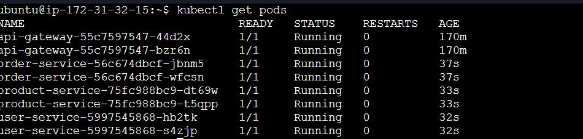
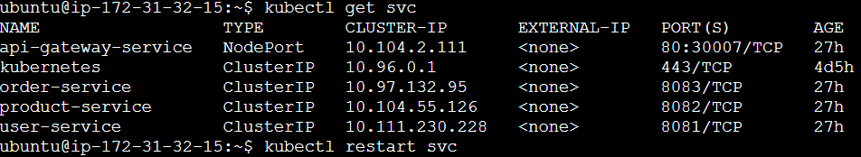
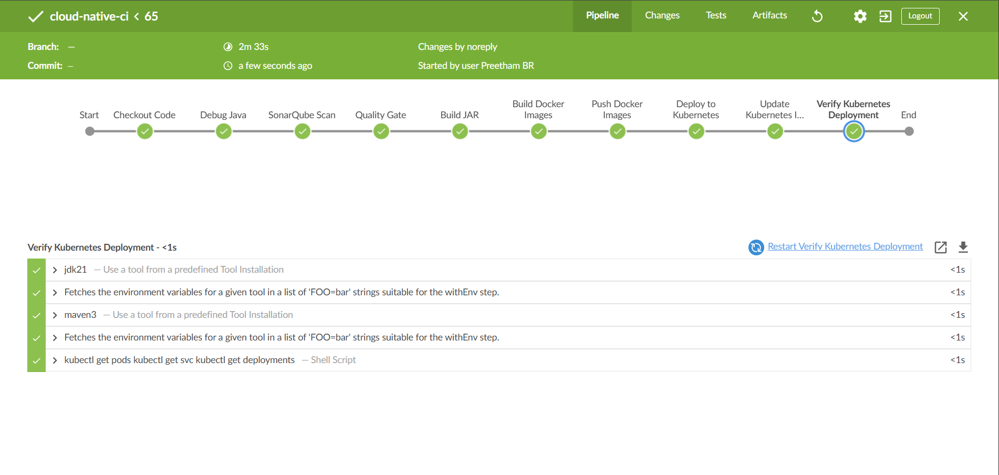
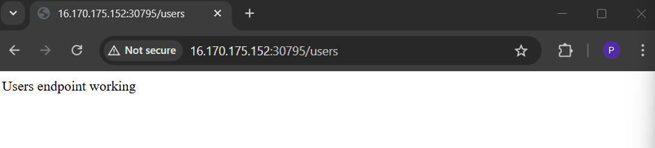

# Cloud Native CI/CD Pipeline with Kubernetes

This project demonstrates a **complete cloud-native CI/CD pipeline** for deploying microservices using modern DevOps tools.

The system is built using **Spring Boot microservices**, containerized with **Docker**, automatically built and deployed using **Jenkins**, analyzed with **SonarQube**, and deployed into a **Kubernetes cluster with NGINX Ingress**.

The goal of this project is to simulate a **real-world DevOps deployment pipeline used in modern cloud environments**.

---

# Project Overview

The project implements a microservices-based application consisting of four services:

* API Gateway
* User Service
* Product Service
* Order Service

Each service is independently built, containerized, and deployed in Kubernetes.

The CI/CD pipeline automatically:

* Fetches source code from GitHub
* Performs code quality analysis using SonarQube
* Builds microservices using Maven
* Builds Docker images
* Pushes images to Docker Hub
* Deploys services into a Kubernetes cluster

---

# Technology Stack

The project uses the following technologies:

Backend

* Java 21
* Spring Boot

Build Tool

* Maven

Containerization

* Docker

CI/CD

* Jenkins
* GitHub

Code Quality

* SonarQube

Container Orchestration

* Kubernetes

Networking

* NGINX Ingress Controller

Cloud Infrastructure

* AWS EC2

---

# Project Architecture

The application follows a **microservices architecture** deployed on Kubernetes.

Each microservice runs inside its own Docker container and is deployed as a Kubernetes Deployment.

The API Gateway exposes the application to external users and routes traffic to internal services.






For a detailed explanation of the architecture see:

docs/architecture.md

---

# CI/CD Pipeline

The project includes a Jenkins pipeline that automates the complete build and deployment process.

Pipeline stages include:

1. Source Code Checkout
2. SonarQube Code Analysis
3. Build Microservices using Maven
4. Build Docker Images
5. Push Images to Docker Hub
6. Deploy to Kubernetes

Jenkins Blue Ocean view of the pipeline:



SonarQube analysis dashboard:


For detailed pipeline explanation see:

docs/pipeline.md

---

# Kubernetes Deployment

All services are deployed inside a Kubernetes cluster.

Each microservice runs as a **Deployment with multiple replicas** to ensure high availability.

Example cluster status:

```
kubectl get pods
kubectl get svc
kubectl get ingress
```

The NGINX Ingress Controller manages external access to the services.

---

# API Endpoints

The API Gateway exposes the following endpoints:

User Service



Product Service


Order Service


These endpoints confirm that all microservices are running successfully inside the Kubernetes cluster.

---

# Running the Project

To set up and run the project from scratch follow the setup guide:

docs/setup-guide.md

The guide includes instructions for:

* Installing prerequisites
* Building services
* Building Docker images
* Deploying to Kubernetes
* Accessing the application

---

# Repository Structure

```
cloud-native-cicd-kubernetes
│
├ .github/workflows
│
├ services
│   ├ api-gateway
│   ├ user-service
│   ├ product-service
│   └ order-service
│
├ kubernetes
│   ├ api-gateway-deployment.yaml
│   ├ user-service-deployment.yaml
│   ├ product-service-deployment.yaml
│   ├ order-service-deployment.yaml
│   └ ingress.yaml
│
├ docs
│   ├ architecture.md
│   ├ pipeline.md
│   ├ setup-guide.md
│   └ images
│
├ Jenkinsfile
├ README.md
└ LICENSE
```

---

# Learning Outcomes

This project demonstrates practical experience with:

* Building microservices architecture
* Implementing CI/CD pipelines
* Containerizing applications with Docker
* Deploying applications using Kubernetes
* Managing ingress traffic
* Automating deployments with Jenkins
* Performing code quality analysis with SonarQube

---

# Author

Preetham BR

DevOps and Cloud Enthusiast

