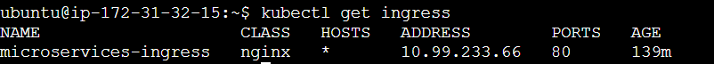
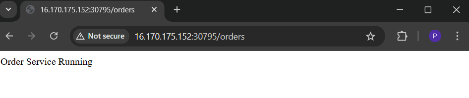
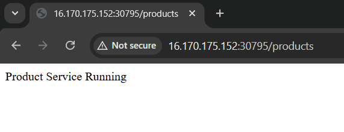

System Architecture

This project demonstrates a cloud-native microservices architecture deployed on 
a Kubernetes cluster.
Each microservice is built using Spring Boot, containerized with Docker, and 
deployed using Kubernetes.

The system is automated with a CI/CD pipeline using Jenkins, and code quality is
analyzed using SonarQube.

The application consists of the following components:
• API Gateway
• User Service
• Product Service
• Order Service
• Kubernetes Cluster
• NGINX Ingress Controller

External users access the application through the API Gateway, which routes requests 
to the appropriate microservice.
________________________________________

Kubernetes Pod Deployment

The following screenshot shows all the running microservice pods inside the Kubernetes cluster.
Pods are responsible for running containerized microservices.
Each service runs multiple pods to provide high availability and scalability.

 
 
From the screenshot we can see:
• API Gateway pods running
• User Service pods running
• Product Service pods running
• Order Service pods running

This confirms that all services are successfully deployed in the cluster.
________________________________________

Kubernetes Services

Kubernetes Services allow communication between different microservices inside the cluster.

  
In this project:
• api-gateway-service is exposed using NodePort
• user-service, product-service, and order-service use ClusterIP
ClusterIP services allow internal communication between microservices.
________________________________________

Kubernetes Ingress

The NGINX Ingress Controller is used to manage external traffic entering the Kubernetes cluster.

 
Ingress acts as a gateway between the internet and the Kubernetes services.
It routes incoming requests to the correct backend service.
________________________________________

API Gateway – User Service

The following screenshot shows the User Service endpoint accessed through the API Gateway.

 
This confirms that the API Gateway successfully routes the request to the User Service.
________________________________________

API Gateway – Order Service

The following screenshot shows the Order Service endpoint accessed through the API Gateway.

 
The response confirms that the Order Service is running correctly inside the Kubernetes cluster.
________________________________________

API Gateway – Product Service

The following screenshot shows the Product Service endpoint.

 
This confirms that the Product Service is reachable through the API Gateway.
________________________________________

Architecture Summary

This architecture demonstrates a complete cloud-native DevOps workflow including:
• Microservices architecture using Spring Boot
• Docker containerization
• Kubernetes deployment and orchestration
• NGINX Ingress for traffic routing
• Jenkins CI/CD pipeline
• SonarQube for code quality analysis

The system is scalable, modular, and follows modern DevOps practices used in real-world 
production environments.
