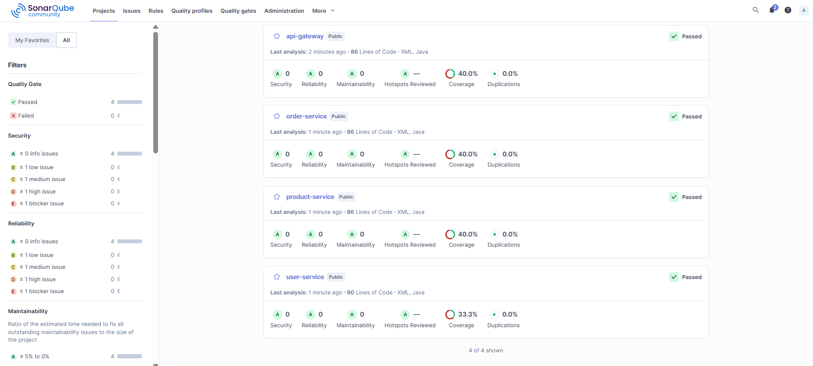

# CI/CD Pipeline

This project implements a **CI/CD pipeline using Jenkins** to automate the build, code analysis, containerization, and deployment of the microservices application.

The pipeline ensures that every change pushed to the repository is automatically built, analyzed, and deployed to the Kubernetes cluster.

---

# Pipeline Workflow

The CI/CD pipeline consists of the following stages:

* Source Code Checkout
* Code Quality Analysis using SonarQube
* Build Microservices using Maven
* Build Docker Images
* Push Docker Images to Docker Hub
* Deploy Microservices to Kubernetes
* Verify Deployment Status

Each stage runs automatically when new code is pushed to the repository.

---

# Jenkins Pipeline (Blue Ocean)

The following screenshot shows the Jenkins pipeline execution using the **Blue Ocean interface**.


Blue Ocean provides a visual representation of the pipeline stages, making it easier to track the progress of the CI/CD workflow.

The pipeline includes stages such as:

* Checkout source code
* Run SonarQube analysis
* Build the application
* Build Docker images
* Push images to Docker Hub
* Deploy to Kubernetes

---

# Code Quality Analysis with SonarQube

SonarQube is integrated into the pipeline to analyze the quality of the source code.



SonarQube performs several checks including:

* Code coverage
* Bugs detection
* Security vulnerabilities
* Code smells

This ensures that the application maintains high code quality standards before deployment.

---

# Docker Image Build

After the code is successfully built, Docker images are created for each microservice.

The following Docker images are generated:

* `preethambr/api-gateway`
* `preethambr/user-service`
* `preethambr/product-service`
* `preethambr/order-service`

These images are pushed to **Docker Hub** so that they can be pulled by the Kubernetes cluster.

---

# Kubernetes Deployment

Once the Docker images are pushed, Jenkins deploys the application to the Kubernetes cluster using `kubectl`.

The deployment process includes:

* Creating Kubernetes Deployments
* Creating Kubernetes Services
* Applying Ingress configuration

This allows the application to be automatically updated whenever a new build is completed.

---

# Deployment Verification

After deployment, Jenkins verifies the cluster status by running the following commands:

```
kubectl get pods
kubectl get services
kubectl get deployments
```

These commands confirm that all microservices are successfully running inside the Kubernetes cluster.

---

# Pipeline Summary

The CI/CD pipeline automates the entire process from **code commit to Kubernetes deployment**.

This pipeline demonstrates a modern DevOps workflow that includes:

* Automated builds
* Continuous code quality checks
* Docker containerization
* Kubernetes deployment automation
* Infrastructure verification

This approach enables faster development cycles and reliable application delivery.

